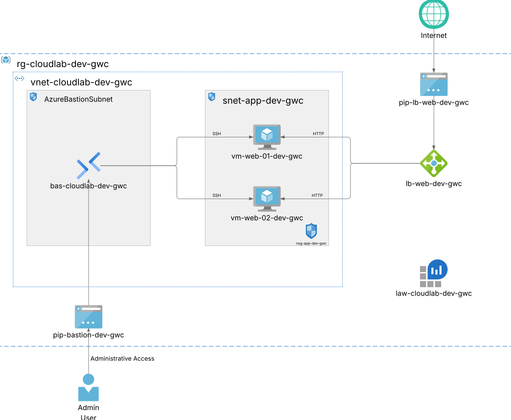

# Azure Terraform Load Balanced Web Platform

A hands-on Azure infrastructure project built with Terraform to deploy a small load-balanced web platform with a public frontend, private ARM64 Ubuntu backend virtual machines, secure administrative access through Azure Bastion, and automated provisioning with cloud-init.

This project was designed as the next step after building:
- a single Linux VM deployment
- a secure two-tier infrastructure
- a private platform with Bastion and monitoring

The goal of this project was to move from **private infrastructure design** to **proper public service delivery**, exposing a web service through a dedicated frontend while keeping the backend virtual machines private.

## Architecture Diagram

The diagram below shows the final deployed architecture, including the public Load Balancer, private backend virtual machines, Azure Bastion for administrative access, and Log Analytics for monitoring.



---

## Project Overview

This project simulates a small but more realistic Azure web platform where:

- the web service is publicly reachable
- the backend virtual machines are **not** directly exposed to the internet
- inbound web traffic is distributed through a **public Azure Load Balancer**
- administrative access is separated from user traffic and handled through **Azure Bastion**
- both backend servers are provisioned automatically with **cloud-init**
- basic observability is included through **Log Analytics**

---

## Architecture Summary

### Public service path
Internet traffic reaches a **Public Standard Load Balancer**, which forwards HTTP requests to one of two private backend Linux virtual machines.

### Private backend
The two backend VMs are deployed inside a private application subnet and do **not** have public IP addresses.

### Administrative access path
Administrative access is provided through **Azure Bastion**, allowing secure access to the private VMs without exposing SSH directly to the internet.

### Monitoring
A **Log Analytics Workspace** is included to provide a monitoring foundation for the platform.

---

## Architecture Flow

```text
Internet
   |
   v
Public Azure Load Balancer
   |
   v
Backend Pool
   |-------------------|
   v                   v
web-vm-01          web-vm-02
(private)          (private)

Admin User
   |
   v
Azure Bastion
   |
   v
Private Backend VMs
```

---

## What This Project Provisions

- Resource Group
- Virtual Network
- Application Subnet
- AzureBastionSubnet
- Application Network Security Group
- Two private ARM64 Ubuntu Linux virtual machines
- Two private network interfaces
- Public Standard Azure Load Balancer
- Public IP for the Load Balancer
- Backend address pool
- HTTP health probe
- Load balancing rule on port 80
- Azure Bastion
- Public IP for Bastion
- Log Analytics Workspace
- cloud-init configuration for automated Nginx deployment

---

## Key Design Choices

**1. Public frontend, private backend**

The web service is exposed publicly through the Load Balancer, while the backend VMs remain private.

**2. No public IPs on backend VMs**

The virtual machines are not directly reachable from the internet, which reduces the exposed attack surface.

**3. Bastion for administrative access**

Administrative SSH access is handled through Azure Bastion instead of direct public SSH.

**4. Two backend nodes**

Two backend web servers were used to introduce basic traffic distribution and service resilience.

**5. Health probe-based routing**

The Load Balancer uses an HTTP health probe to route traffic only to healthy backend instances.

**6. ARM64 Ubuntu deployment**
    
The backend VMs use ARM64 Ubuntu images to maintain consistency with the rest of the project portfolio and to demonstrate awareness of architecture and SKU compatibility.

---

## Azure Configuration Used
- Region: `germanywestcentral`
- VM Size: `Standard_B2pts_v2`
- OS: Ubuntu 24.04 LTS ARM64
- Authentication: SSH key-based authentication only
- Load Balancer SKU: Standard
- Bastion SKU: Basic
- Monitoring SKU: Log Analytics Workspace (`PerGB2018`)

---

## Network Design

### Virtual Network

The project uses a dedicated virtual network with separate subnets for workload and administrative access.

### Subnets
- Application Subnet: hosts the two private backend VMs
- AzureBastionSubnet: dedicated subnet required by Azure Bastion

### NSG Logic
The application subnet is protected by an NSG that allows:

- HTTP traffic for the web service
- Load Balancer health probe traffic
- SSH access from inside the virtual network for Bastion-based administration

---

## Backend Provisioning

Both VMs are provisioned automatically using cloud-init.

Each VM installs and starts Nginx during deployment and serves a slightly different HTML page so traffic distribution can be verified from the public frontend.

Example behavior:

- `web-vm-01` serves a page identifying backend node 1
- `web-vm-02` serves a page identifying backend node 2

This makes it possible to validate that the Load Balancer is actually distributing requests between the two private instances.

---

## Repository Structure

```text
.
├── cloud-init/
│   ├── vm1-cloud-init.yaml
│   └── vm2-cloud-init.yaml
├── modules/
│   ├── bastion/
│   ├── compute/
│   ├── loadbalancer/
│   ├── monitoring/
│   └── network/
├── locals.tf
├── main.tf
├── outputs.tf
├── providers.tf
├── terraform.tfvars.example
├── variables.tf
└── versions.tf
```

---

## Terraform Module Breakdown

`network`

Creates:

- resource group
- virtual network
- application subnet
- AzureBastionSubnet
- application NSG
- subnet-to-NSG association

`compute`

Creates:

- two NICs
- two private Linux VMs
- SSH key configuration
- cloud-init based Nginx provisioning

`bastion`

Creates:

- public IP for Bastion
- Azure Bastion host

`loadbalancer`

Creates:

- public IP for the Load Balancer
- public Load Balancer
- backend pool
- HTTP health probe
- load balancing rule
- backend NIC associations

`monitoring`

Creates:

- Log Analytics Workspace

---

## Deployment Prerequisites

Before deployment, make sure you have:

- an Azure subscription
- Terraform installed
- Azure CLI installed
- an authenticated Azure session
- an SSH key pair available locally

---

## How to use

### 1. Clone the repository

```bash
git clone https://github.com/YOUR-USERNAME/Azure-Terraform-Load-Balanced-Web-Platform.git
cd Azure-Terraform-Load-Balanced-Web-Platform
```
### 2. Create a tfvars file

```bash
cp terraform.tfvars.example terraform.tfvars
```
### 3. Initialize Terraform

```bash
terraform init
```

### 4. Review the execution plan

```bash
terraform plan
```

### 5. Deploy the infrastructure

```bash
terraform apply
```

### 6. Destroy the infrastructure when no longer needed

```bash
terraform destroy
```

---

## Validation Performed

The infrastructure was deployed and validated successfully.

The following checks were performed:

- Terraform deployment completed successfully
- the public Load Balancer became reachable from the internet
- repeated requests confirmed traffic distribution across both backend nodes
- each backend VM served a distinct Nginx page
- Azure Bastion access to the private VMs was successfully validated
- the backend VMs were confirmed to be private-only
- the final architecture behaved as expected in the target region

---

## Troubleshooting Notes

This project included real troubleshooting during deployment and validation.

### Resource group dependency issue

During the first deployment attempt, some resources in downstream modules tried to create before the resource group was fully available.

This was resolved by making downstream modules consume the resource group name and location from the network module outputs, creating a proper Terraform dependency chain.

### Load Balancer and NSG logic

The NSG logic was refined to correctly separate:

- public HTTP traffic
- Load Balancer health probe traffic

This ensured the service remained publicly reachable while still allowing proper backend health evaluation.

---

## What This Project Helped Me Practice

- Public frontend and private backend platform design
- Azure Load Balancer fundamentals
- Backend pool and health probe configuration
- Multi-VM infrastructure design with Terraform
- Secure administrative access through Azure Bastion
- SSH key-based Linux VM authentication
- cloud-init automation across multiple instances
- ARM64 VM deployment on Azure
- Terraform module design and dependency management
- Real-world troubleshooting during infrastructure deployment

## Possible Future Improvements

Some natural next steps for this architecture would be:

- HTTPS termination
- custom domain and DNS integration
- Application Gateway or Layer 7 routing
- VM Scale Sets
- stronger monitoring and alerting
- TLS certificates
- autoscaling
- CI/CD integration

These were intentionally left out to keep the project focused, readable, and aligned with the specific goal of demonstrating public service delivery through a load-balanced frontend with private backend VMs.

## Final Takeaway

This project demonstrates how to publish a small web service on Azure in a more realistic way by using:

- a public Load Balancer
- private backend virtual machines
- Azure Bastion for secure administration
- Terraform modules for clean infrastructure organization
- cloud-init for automatic provisioning

It was built and validated as a practical portfolio project to show progression from basic infrastructure provisioning to more mature cloud platform design.

